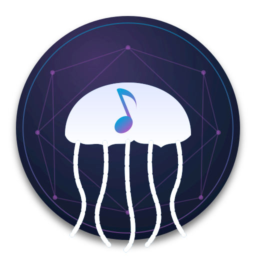

<div align="center">
  
</div>

<div align="center">
  
  <b>This took a whole lot of testing and debugging, but we made it!. if you enjoyed the project, please feel free to buy me a coffee! </b>
  
  </div>

  
  <div align="center">
  
</div>

# JellyMusicDiscovery

A Jellyfin plugin that turns Jellyfin's music section into a discovery
surface — find music you don't currently have in your library with lyrics included, 
play it instantly, watch music videos, listen to internet radio, and (optionally) download the track to your
library when you 'favorite' the track or album.

This has been tested and music-wise it works wonderfully with the client "Finer" 
and if you want to also watch the videos, the Jellyfin app itself does very well.

This plugin works seamlessly and compliments [Gelato](https://github.com/lostb1t/Gelato) quite nicely!

---
## What this plugin and its companions do

The bundle gives you six features, each independently optional. Every
one of them works with the standard Jellyfin web/Android/iOS clients —
you don't need a custom client, just the plugin installed on the server.

### 1. Discovery search — find music you don't currently have in your library
Type anything into Jellyfin's search bar. Alongside the tracks already
in your library, you'll see hits from **Deezer**, **iTunes
Search API**, and **MusicBrainz**. They're labeled visually so you know
they're not in your library yet.
- **Needs:** nothing extra. Built into the plugin itself, queries
  public/no-auth APIs at search time.


### 2. Play any music — even music you don't currently have in your library
Hit Play on a discovery result and it plays instantly, with no
download wait. Under the hood:
- The plugin redirects the player to `ytmusic-stream-server`, which
  uses **`yt-dlp`** (the youtube-dl successor) to find the matching
  track on YouTube Music, extract a direct audio CDN URL, and 302 the
  player there.
- iTunes/Deezer/MusicBrainz are *only used for finding the track exists*
  — once found, the audio stream is always sourced from YouTube Music.
  This is why no iTunes/Deezer accounts are needed.
- **Needs:** `ytmusic-stream-server` running (Docker container in this
  bundle) + `YtMusicStreamServerUrl` set in the plugin's settings.

### 3. Music videos — auto-populated per artist
Search for any artist in Jellyfin and scroll down to the **Videos** section, this will fill up with
that artist's music videos. Click one and it plays in Jellyfin's video
player, full screen if you want.
- The plugin's search/detail filters call
  `ytmusic-stream-server`'s `/search/videos?artist=` endpoint.
- The server uses `ytmusicapi` to find music videos and `yt-dlp` to
  resolve direct DASH (H.264 ≤1080p) + AAC streams; `ffmpeg` muxes
  them into a single playable mp4 on the fly.
- The plugin registers a synthetic `MusicVideo` library item per
  result so it shows up in the artist's Videos tab natively.
- **Needs:** same as feature 2 — `ytmusic-stream-server` + the URL set.
- **Scope:** music videos only. Not general video, not movies/TV , 
(Gelato and Jellyfin already do that).

### 4. Discovery playlists — auto-generated, three sources
Jellyfin's playlists feed gets new dynamic sections injected the moment
the plugin loads. There's nothing static to "import" — the plugin
fetches them live and refreshes periodically. Three sources:

**Deezer charts (8 playlists, no setup):**
🇺🇸 Top 50 USA · 🔥 Top 100 Global · 🎸 Top Rock · 🎤 Top Pop ·
🎧 Top Electronic · 🎵 Top Hip-Hop · 🤘 Top Metal · 🆕 New Releases.
Public Deezer chart APIs, no auth. Tracks *display* immediately; they
*play* only with `ytmusic-stream-server` (since audio comes from YT
Music, not Deezer — Deezer's only used for the catalog metadata).

**YouTube Music charts (12 playlists):**
- YT 🏋️ Workout · YT 🎉 Party · YT 🚗 Commute · YT ⚡ Energy
  Boosters · YT 😊 Feel Good *(mood-based — pulled from YT Music's
  mood categories)*
- YT 🎤 Hot Hits Pop · YT 🎸 Hot Hits Rock · YT 🖤 Hot Hits Emo ·
  YT 🎧 Hot Hits Electronic *(YT Music's weekly-updated "Hot Hits"
  curated playlists)*
- YT 💭 Forgotten Favorites · YT 🆕 New Releases · YT 🇯🇵 J-Pop
  *(broad search-backed playlists)*

Visible AND playable only when `ytmusic-stream-server` is configured;
without it the plugin silently omits these sections. Track lists
update on a TTL refresh — typically a few hours — so you'll see
fresh content periodically.

**📻 Internet radio (6 playlists, no setup):**
*Top US Stations · iHeartRadio · Hip-Hop / R&B · Pop / Top 40 · Rock ·
News & Talk*. Each station resolves to a direct stream URL
(mp3/aac/ogg) from radio-browser.info — the Jellyfin player connects
to that URL directly. Doesn't go through `ytmusic-stream-server` at
all, and works with zero additional setup. A `BlockedRadioStations`
config setting drops stations by substring match.

**TL;DR:** Install the plugin alone → 14 playlists appear immediately
(8 Deezer + 6 radio). The 6 radio playlists play right away; the 8
Deezer playlists need `ytmusic-stream-server` to be playable. Add
`ytmusic-stream-server` and you also get **12 YouTube Music playlists**
on top, for **26 total discovery playlists** auto-injected into your
Jellyfin home screen.

### 5. Synced lyrics for discovery tracks (built-in)
Click play on a discovery hit and the player UI shows **karaoke-style
synced lyrics** if `lrclib.net` has them — same source the popular
"LrcLib" Jellyfin plugin uses, but called directly so it works for
tracks that aren't in your library yet (Jellyfin's normal lyrics
pipeline only fires for real library items).

- **Built-in** — no extra container, no config. Queries lrclib.net
  anonymously, caches results in memory, falls back to plain (un-
  timestamped) lyrics if synced isn't available, 404s silently if
  neither exists.
- **No `.lrc` files written to disk.** Lyrics are served on the fly
  via Jellyfin's `/Audio/{id}/Lyrics` route. (If you do see `.lrc`
  files appearing in your library after auto-downloads, they came
  from the Soulseek peer's share, not from this plugin.)
- **Recommended companion for real library tracks:** install the
  standalone [LrcLib Jellyfin plugin](https://github.com/jellyfin/jellyfin-plugin-lrclib)
  too. This plugin handles lyrics for *discovery stubs*; the LrcLib
  plugin handles them for tracks already in your library. They
  coexist cleanly — different code paths, no conflict.

### 6. Auto-download what you 'favorite' (optional)
Heart a discovery result track or album in Jellyfin and it triggers
**Lidarr → Soularr → slskd → slskd-organizer** to grab the album,
move it into `/music/{Artist}/{Album}/{NN - Title}.flac`, then ping
Jellyfin to rescan. Next time you search, the track is in your library
proper instead of a discovery hit.
- **Needs:** Lidarr + Soularr + slskd installed and running. The
  `slskd-organizer` container in this bundle handles the file
  move/rename + Jellyfin rescan trigger. Significantly more setup
  than the other features — see "Install order" below.

  **I look forward to the open-source evolution of this porject and the wonderful future contributions from the community**
---

## install — what to do

**!!! Because there are so many pieces to this puzzle it is easy for some things not to click. 
I really recommend you download Claude Code and have it do the installation, or have it SSH into your raspberry pi and do the installation.
All you need to do is provide Claude the instructions (this readme), the files, the location of your library and the location of your plugin folder.
Generally it will help you with updating the version of YT-dlp which gets deprecated sosmewhat often, 
and making sure all permissions are up and running properly !!!**


There are three sensible levels of install. Pick whichever fits how
much setup you want to do.

### Level 1: Just the plugin (5 minutes)
You'll get **14 discovery playlists** (8 Deezer + 6 internet radio),
plus inline search results from Deezer / iTunes / MusicBrainz. The
radio plays right away; the Deezer hits will *display* but not play
until you add Level 2.

1. Download `plugin/JellyMusicDiscovery.zip` from this repo (or build
   it yourself: `cd plugin/source && make package`).
2. Find Jellyfin's plugins folder for your install — see
   [`plugin/INSTALL.md`](plugin/INSTALL.md) for the path on every
   common platform.
3. Make a folder named `MusicDiscovery_0.1.0.0` inside the plugins
   folder, unzip the bundle into it.
4. Restart Jellyfin. The plugin appears under **Dashboard → Plugins
   → Music Discovery**.

### Level 2: Plugin + instant playback + music videos + YT Music playlists (15 minutes)
Adds the `ytmusic-stream-server` companion. After this, every
discovery hit plays instantly, every artist's "Videos" tab fills with
music videos, and you get **12 more curated playlists** for a total
of **26 dynamic playlists** auto-injected into your home screen.

1. Do Level 1.
2. On a machine with Docker (your Pi, your Mac running Docker
   Desktop, anywhere on your LAN):
   ```bash
   cd ytmusic-stream-server
   docker compose up -d --build
   ```
   The service listens on `:8077`.
3. In Jellyfin: **Dashboard → Plugins → Music Discovery → Settings**.
   Set **YT Music Stream Server URL** to `http://<that-machine>:8077`
   (or `http://localhost:8077` if it's on the same box). Save.
4. Refresh your Jellyfin home screen — the Deezer playlist tracks
   now play, the YT Music playlists appear, and Play on any
   discovery search hit works.

### Level 3: Plugin + everything + auto-download from favorites (an hour or two)
Adds the Lidarr → Soularr → slskd → slskd-organizer chain. After
this, hearting a discovery result actually downloads the album into
your music library and Jellyfin rescans automatically.

This is the heaviest setup because it involves four extra services
and a Soulseek account. Follow the **"Install order"** section
further down this README — it walks through each layer with the
gotchas (Lidarr `UMASK=000`, the Soularr version-check patch, etc.).

---

## Requirements & compatibility

### Jellyfin
- **Server version: 10.11.x.** The plugin's `meta.json` declares
  `targetAbi=10.11.0.0` and the source is built against the
  `Jellyfin.Common/Controller/Model 10.11.2` packages. It will load on
  any 10.11.x. **It will NOT load on 10.10 or earlier** — Jellyfin's
  plugin ABI changed. If you need a 10.10 build, you'd have to
  rebuild against the older NuGet packages and adjust the API
  surface that changed.
- **No special Jellyfin server config needed.** No external auth, no
  reverse-proxy gymnastics.
- **No extra Jellyfin plugins required.** Specifically: you do **not**
  need the iTunes Music plugin, the MusicBrainz metadata plugin, or
  any other discovery plugin installed alongside this one.

### Operating systems

The plugin DLL is fully managed .NET code and is platform-agnostic. The
companion services are Docker containers. Net result:

| Platform | Plugin | Companion containers |
|---|---|---|
| Linux x64 (Ubuntu, Debian, etc.) | ✅ | ✅ via Docker |
| Linux ARM64 (Raspberry Pi 4/5, Apple Silicon Asahi, etc.) | ✅ | ✅ via Docker — confirmed working on Pi 5 |
| macOS (Apple Silicon or Intel) | ✅ | ✅ via Docker Desktop |
| Windows | ✅ | ✅ via Docker Desktop (WSL2 backend) |
| FreeBSD / TrueNAS Jellyfin jail | ✅ | requires running the containers somewhere reachable on your LAN — they don't have to live on the same box as Jellyfin |
| Synology / unRAID | ✅ | ✅ — both have Docker support |

The Pi 5 setup that this bundle was developed against runs the plugin
inside Jellyfin's docker container plus separate containers for slskd,
Lidarr, Soularr, slskd-organizer, and ytmusic-stream-server, all on the
same docker-compose stack. None of these have to be co-located — the
plugin talks to them over HTTP, so a multi-machine setup is fine.

### Hardware notes

- **Music-video muxing on weak hardware:** `ytmusic-stream-server`
  pulls DASH video + audio as separate streams from YouTube and uses
  ffmpeg to mux them into a playable mp4 on the fly. Pi 4 and Pi 5
  handle 1080p comfortably. Older Pis or low-RAM mini PCs may stutter
  — drop the format selector in `app.py`'s `YDL_VIDEO_OPTS` from
  `<=1080` to `<=720` to halve the bandwidth/CPU cost.
- **yt-dlp breaks regularly.** YouTube changes their player JS every
  few weeks and a stale yt-dlp will start failing with
  `Unable to extract player ...`. The container's Dockerfile
  intentionally does `pip install -U --pre yt-dlp` at every build, so
  the fix when this happens is `docker compose build --no-cache &&
  docker compose up -d` on the `ytmusic-stream-server` container.
  Plan to do this every 1–6 months. (This is a yt-dlp reality, not
  something this project introduced.)
- **Disk for downloads:** the auto-download pipeline (Lidarr/Soularr/
  slskd) writes FLACs, which average ~25–40 MB per track. Album of
  11 tracks ≈ 250 MB. Plan storage accordingly.

### Network / accounts

- **Soulseek account required** *only if* you want auto-download.
  Make a free account at slsknet.org and put the credentials into
  slskd's config. Discovery + streaming + radio + music videos all
  work without any Soulseek account.
- **No YouTube account required.** yt-dlp queries YouTube's public
  endpoints anonymously. (If yt-dlp eventually starts requiring auth
  cookies for some content, the workaround is documented in the
  `ytmusic-stream-server/README.md`.)

## What's in this bundle

```
JellyMusicDiscovery-v0.1.0/
├── README.md                       ← you are here (architecture + full stack)
├── plugin/
│   ├── JellyMusicDiscovery.zip     ← drop-in plugin (unzip into Jellyfin plugins dir)
│   ├── meta.json                   ← plugin metadata (version, GUID, ABI target)
│   ├── INSTALL.md                  ← step-by-step plugin install
│   └── source/                     ← full C# source — `make package` rebuilds
├── slskd-organizer/                ← container that auto-sorts slskd downloads
│                                     into {Artist}/{Album}/{NN - Title}.{ext}
├── ytmusic-stream-server/          ← FastAPI service that streams YouTube Music
│                                     to Jellyfin for instant playback
└── patches/
    └── soularr-version-check.diff  ← required tweak to Soularr for non-semver
                                     slskd builds
```

## Architecture

```
   ┌─────────────────────────────────────────────────────────┐
   │  Jellyfin                                               │
   │  ┌────────────────────┐   ┌─────────────────────────┐   │
   │  │ JellyMusicDiscovery│ → │ Lidarr API: add album   │   │
   │  │ (this plugin)      │   │ /api/v1/album           │   │
   │  └─────────┬──────────┘   └──────────┬──────────────┘   │
   │            │ play track from         │                  │
   │            │ a non-library result    ▼                  │
   │            │              ┌──────────────────────────┐  │
   │            │              │  Lidarr (monitors,       │  │
   │            │              │  delegates to Soularr)   │  │
   │            │              └──────────┬───────────────┘  │
   │            ▼                         ▼                  │
   │  ┌────────────────────┐    ┌─────────────────────────┐  │
   │  │ ytmusic-stream-    │    │  Soularr ←─→ slskd      │  │
   │  │ server (FastAPI)   │    │  (search Soulseek peers,│  │
   │  │ proxies youtube    │    │   download FLAC/MP3)    │  │
   │  └────────────────────┘    └──────────┬──────────────┘  │
   │                                       ▼                  │
   │                            ┌─────────────────────────┐  │
   │                            │  slskd-organizer        │  │
   │                            │  (reads ID3, moves to   │  │
   │                            │   /music/{Artist}/{Album})│ │
   │                            └──────────┬──────────────┘  │
   │                                       ▼                  │
   │                            POST /Library/Refresh ─────  │
   └─────────────────────────────────────────────────────────┘
```

### Discovery (no setup needed)

The plugin's search injection works **without** any companion services.
It queries Deezer + iTunes + MusicBrainz at search time, dedupes against
your library, and surfaces non-library hits inline in Jellyfin's
search results. This is the no-friction default.

### Download pipeline (optional)

When the user favorites a discovery result, the plugin POSTs to Lidarr's
`/api/v1/album` with the resolved MusicBrainz album ID. From there the
flow is:

1. **Lidarr** decides whether to monitor and what release/quality to look
   for.
2. **Soularr** polls Lidarr for missing albums and runs `slskd` searches
   on them. When matches come back it triggers downloads.
3. **slskd** does the actual Soulseek transfers. Files land in
   `/portainer/Downloads/<peer>/<filename>`.
4. **slskd-organizer** (this bundle's container) watches that directory,
   reads ID3/Vorbis tags, and moves completed files into
   `/portainer/Music/{Artist}/{Album}/{NN - Title}.{ext}`. After each
   batch with at least one move it pings Jellyfin's `/Library/Refresh`.
5. **Jellyfin** rescans, the new album shows up in "Recently Added",
   and the plugin reconciles its discovery stub against the new library
   item.

### Streaming (optional, but this is what makes the plugin feel magic)

`ytmusic-stream-server` is a small FastAPI service that backs **two**
play paths:

- **Audio streaming for non-library tracks.** When a user hits Play on a
  Deezer/iTunes/MusicBrainz discovery hit, the plugin's
  `DiscoveryMediaSourceProvider` returns a `MediaSource` whose URL
  points at `/stream/by-video/{videoId}` on this service. The service
  resolves the YouTube Music videoId to a direct audio URL via yt-dlp
  and 302-redirects the player there. Result: the track plays
  immediately, before Lidarr/slskd have finished downloading anything.

- **Music videos.** The plugin registers stub `MusicVideo` library items
  (one per result the artist-videos augmenter finds) at synthetic paths
  `/mdiscover-video/{id}.mp4`. When Jellyfin's video player asks for a
  media source, the provider hands back a `MediaSource` with both a
  video stream (H.264 ≤1080p, DASH) and an audio stream (AAC), routed
  to `/video/by-id/{videoId}`. The stream server fetches both DASH
  streams and ffmpeg-muxes them into a single playable mp4. These show
  up under the artist's "Videos" tab in Jellyfin's web UI.

**Without `YtMusicStreamServerUrl` set in the plugin's config, neither
play path works** — discovery results stay search-only (visible but
not playable), and music videos don't get registered at all. The
plugin logs `[mdiscover-feed] YT Music skipped: YtMusicStreamServerUrl
not set` when this happens.

This is *only* about playback. Discovery search and the
favorite-→-Lidarr-→-slskd download flow work without the stream
server; you'd just have to wait for the download to finish before
hearing anything.

## Install order

Install bottom-up — each layer depends on the ones below it.

1. **Jellyfin** — already running, presumably.
2. **slskd** — Soulseek client, runs as a container. Configure your
   Soulseek username/password in its UI. Make sure its downloads
   directory is on a host path you can mount into other containers.
3. **Lidarr** — set rootFolderPath to your music library
   (`/data/music`). **Important:** set `UMASK=000` on its container
   (linuxserver image) so files it writes are world-readable +
   deletable. Without this, Jellyfin can't delete tracks Lidarr placed.
4. **Soularr** — bridge between Lidarr and slskd. After install,
   apply `patches/soularr-version-check.diff` (see `patches/README.md`)
   if your slskd version string isn't strict semver.
5. **slskd-organizer** — `cd slskd-organizer && docker compose up -d
   --build`. Configure `JELLYFIN_URL` + `JELLYFIN_API_KEY` in its
   `docker-compose.yml` so it can ping Jellyfin to rescan after moves.
6. **ytmusic-stream-server** (optional) — `cd ytmusic-stream-server &&
   docker compose up -d --build`. Listens on `:8077`.
7. **JellyMusicDiscovery plugin** — see `plugin/INSTALL.md`. Configure
   the Lidarr / slskd / ytmusic-stream-server URLs + API keys in its
   settings page.

## Things to know

### Lidarr's UMASK matters

The default `linuxserver/lidarr` image runs with `UMASK=022`, which writes
files as `644` and folders as `755`. If your Jellyfin container runs as
a different uid (likely), Jellyfin's "Delete" button on a track will fail
with `Permission denied`. Set `UMASK=000` in Lidarr's compose env to get
`666`/`777`. The bundled `slskd-organizer` already does the equivalent
(`os.umask(0o000)` + explicit chmod after move).

### Wrong-album matches

The plugin's Lidarr matcher does token-set comparison on album titles
with a small allowlist of qualifier words (`soundtrack`, `deluxe`,
`expanded`, etc.) — that's because substring matching falsely matches
"The Greatest Show" against "The Greatest Showman". It also tolerates
artist mismatches when the album is marked as a soundtrack (the
soundtrack is often credited to the composer, not the performers).

### Lidarr re-monitor race

Lidarr's `RefreshArtist` task (which runs after adding an artist) can
flip `monitored=False` 5–10 seconds after we set it true. The plugin
schedules a delayed re-fixup PUT 20 seconds after every album add, which
re-applies monitoring after the refresh has settled. If you ever see
albums stuck on `monitored=False`, look at `LidarrClient.cs` — that's
where the fixup lives.

### File permissions on existing music

If you've ever run Lidarr with the default `UMASK=022`, you'll have a
mountain of music files Jellyfin can't delete. After fixing Lidarr's
UMASK for new files, fix the existing ones once with:

```bash
sudo find /portainer/Music -type d -exec chmod 777 {} +
sudo find /portainer/Music -type f -exec chmod 666 {} +
```

## Building from source

The plugin requires .NET 9 SDK.

```bash
cd plugin/source
make package
# → ../artifacts/JellyMusicDiscovery.zip
```

The `csproj` has a `StripUnneededDlls` target that deletes the
Jellyfin/Microsoft/System DLLs Jellyfin already provides at runtime, so
the zip stays small (~310 KB). `TagLibSharp.dll` *is* shipped because
Jellyfin doesn't bundle it.

## License / attribution

Self-hosted, no warranty, etc. Some files in this stack are derivative of
or interact with third-party projects:

- [Jellyfin](https://jellyfin.org) — GPLv2
- [Lidarr](https://lidarr.audio) — GPLv3
- [Soularr](https://github.com/mrusse/soularr) — patches in `patches/`
- [slskd](https://github.com/slskd/slskd) — AGPLv3
- [TagLibSharp](https://github.com/mono/taglib-sharp) — LGPLv2.1 (shipped
  in the plugin zip per its license terms)
- [ytmusicapi](https://github.com/sigma67/ytmusicapi) — MIT
- [yt-dlp](https://github.com/yt-dlp/yt-dlp) — Unlicense
